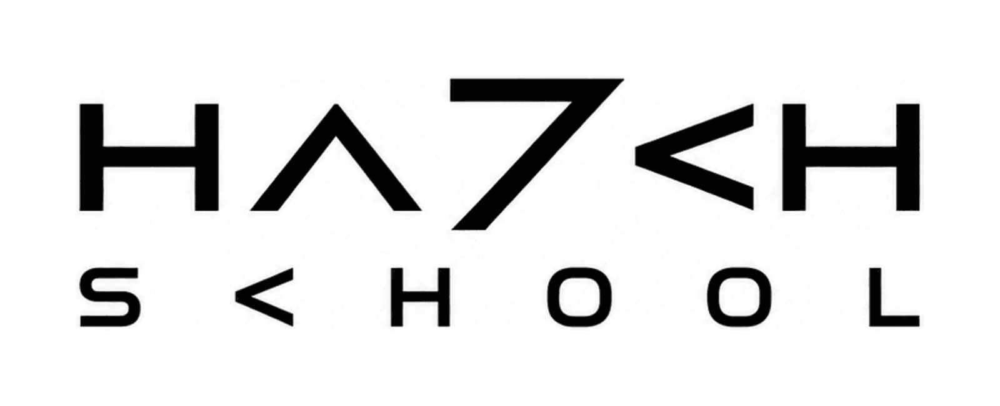

# HA7CH AI Native School 🎓



> 把 HA7CH 变成一所学校。加载即入学——一个懂行的 Agent 导师，带着你学。

这不是一堆文档让你自己啃，是一个 **Claude Code skill**：你的 Agent 加载它，就变成 HA7CH 这所 AI Native 学校的导师本人，坐在你旁边、按你的能力和节奏，一节一节把 HA7CH 的真东西讲进你脑子里。

## 它跟别的"教程 skill"不一样在哪

- **加载即入学**：一加载就主动开口问你——想先上哪门课？不用你去翻。
- **skill 里面套 skill（渐进式加载）**：入口只是"教务处"，每门课、每一节课都是独立文件，**走到哪节才加载哪节**，上下文永远精简。
- **主线程带学，随时能打断**：教学全程在主对话里，你随时提问、随时让导师去查资料，但主线永远是"这堂课"——不会把你甩进一个看不见的后台。
- **按能力画像动态排课**：课程顺序不是死的 01→02→03。导师先摸清你强在哪、虚在哪，**从你熟的那块切入，把你最弱的那块压到后面、重点精讲**。商务背景想做 FDE？先过商务，技术压轴补。技术背景？先讲技术，再逼你去现场摸需求。
- **真上手，不是模拟**：实验课直接把 HA7CH 的真能力拉起来让你用一次（把简历变成 `cv.ha7ch.com` 活页面、被 School 内置 FDE 诊断诚实照一次）。
- **跨会话记进度**：像真学校一样记得你学到哪、懂多少，下次接着上。

## 目前开两门课

### ① AI Native
搞懂这个时代到底怎么工作。
1. **零 Token 设计** —— AI 产品不必自己烧 token，让用户的 agent 干活、产品接住结果。
2. **ChatGPT Work 之后** —— 这套架构怎么从"开发者的设计"变成"所有人的设计"。
3. **实操：把简历变活** —— 亲手用 `cv.ha7ch.com` 做一个零 token / AI native 产品出来。
4. **HA7CH 精选** —— 按兴趣延伸，把内核连成面。

### ② FDE（Forward Deployed Engineer）
搞懂 FDE 是什么、你适不适合、怎么入局。
1. **FDE 到底是什么** —— 起点终点四条硬指标 + Echo/Delta，分清它和外包。
2. **FDE 九宫格** —— 商务/产品/研发 × 三层客户，判断客户在哪一层、该怎么打。
3. **实操：被诊断 & 货代擂台** —— 被 School 内置诊断 Skill 诚实照一次（缺 Echo 还是 Delta），再亲手练一次摸真需求。
4. **一线四城调查** —— 北上深杭 129 位 builder，"有生意没行业"的真实市场坐标。

### 共修 · GitHub（两门课共用的图谱节点，没有序号）
给完全没碰过 GitHub 的人（产品/商务/运营背景）补上 AI 时代的协作语言——**不背命令（命令归 agent），只学词汇和验收**。什么时候学、要不要学，导师按你的情况现场定：
- **概念课｜GitHub：AI 时代的协作语言** —— repo / commit / branch+PR / issue / fork / merge 即上线，六个词讲透。
- **实验课｜第一个 issue 和第一个 PR，就提在这所学校** —— 真实 fork 本仓库、把名字写上校友墙 [`WALL.md`](WALL.md)，合并那一刻 [school.ha7ch.com/WALL.md](https://school.ha7ch.com/WALL.md) 自动上线你的名字。**学校自己就是教具。**

### 共修专项 · 与一号位沟通
给准备进入企业、面对老板或业务最终决策人的学生补上商务推进能力。不是背销售话术，而是完成三个真实动作：
- **会前**：以价值伙伴心态做企业功课，把技术变成具体产品机会，练好 30 秒表达。
- **会中**：用事实建立信任，处理技术边界、竞品、犹豫与专业 pushback。
- **会后**：判断真实意愿，把兴趣推进成有数据、指标、负责人和停止条件的 POC，并复盘真实沟通。

它不单独占一个入学选项，由 AI Native / FDE 课程按学生是否准备见企业、接项目或进入现场动态接入；也可以直接说「带我练一号位沟通」「客户拿竞品压我怎么办」进入。

## 从公开课走进现场

已经熟悉 Codex，并且能做出一个可运行的产品，或者有扎实的商务、咨询、销售与客户沟通能力，可以继续参加 [HA7CH FDE Camp](https://github.com/HA7CH/anc-fde-camp/blob/main/SKILL.md)。这是两天一夜的线下小班：把企业判断、AI 构建、客户沟通和现场交付串成一条路，经过 Whiteboard Interview 达到毕业线后，获得 `HA7CH FDE Certified` 并进入 FDE 人才池。

当前深圳班为 2026 年 9 月 12—13 日，¥12,800 / 人。时间和行程在报名付款前请再确认；报名加微信 `lawtedwu`，好友申请写 `FDE CAMP`。

## 安装

最快是一条 npx：

```bash
npx @ha7ch/school            # 自动探测装到 ~/.claude/skills/ha7ch-school
npx @ha7ch/school --codex    # Codex 用户装到 ~/.codex/skills/
npx @ha7ch/school --force    # 更新到最新（学习进度在 ~/.ha7ch-school/，不受影响）
```

其它方式：把「读 https://school.ha7ch.com/install.md ，帮我把 HA7CH School 装上」贴给你的 agent；免安装则贴「读 https://school.ha7ch.com/school.md ，带我上课」；开发者也可以直接 `git clone https://github.com/HA7CH/ha7ch-school ~/.claude/skills/ha7ch-school`。

装好后在 Claude Code 里 `/ha7ch-school`（或对它说"带我学 AI Native / 想学 FDE / ha7ch school"）即可入学。

**课程会自己保持最新。** 每次开课前，导师先比对本地与线上 `manifest.json` 的版本：一致就闭嘴直接上课；落后就说一句「学校更新了，我顺手更一下」然后自动跑 `--force` 重装，接着上课——学生不用记得手动更新，也不用重开会话（讲义是走到哪节读哪节，更完立即生效）。没网或更新失败就静默跳过、照旧上课。**校验和更新都是学生自己的 agent 干的，学校一个 token 都不烧**——这本身就是课上讲的零 token 设计。

**配套能力**：`fde-diagnosis` 已内置，无需另装；`cv-pro` 仍按需安装。外部能力不可用时，导师会如实降级演示。

## 结构

```
SKILL.md                       入学处：加载即问学哪门课、维护学习存档、按能力画像排课
WALL.md                        校友墙：每一行都是一位学生被合并的第一个 PR
references/
  pedagogy.md                  教学法内核：动态排课引擎（先强后弱、弱项压轴精讲）
  state-schema.md              学习存档格式（跨会话续学）
  course-ai-native.md          AI Native 课程大纲 + 自适应分支
  course-fde.md                FDE 课程大纲 + 自适应分支
  course-executive-communication.md  共修专项：与一号位沟通
  sources.md                   全部 source 清单（文章 URL / 本地素材 / 实操产品）
  lessons/
    ai-native/                 4 节讲义
    fde/                       4 节讲义
    shared/                    共修课讲义（GitHub ×2，两门课共用）
    executive-communication/   3 节讲义（会前 / 会中 / 企业试点）
  executive-communication/    方法、场景、评分与复盘模板
```

每节讲义都锚定真实素材：HA7CH 的原文文章、Lawted 本人的口播稿、以及真产品。

## 学习进度存哪

`~/.ha7ch-school/{handle}.json`（单机本地，各自机器存各自的，互不干扰）。

## 发版（维护者）

课程走两条分发路径，**必须同时更新**：托管站（`school.ha7ch.com`，随 master 合并由 Vercel 自动部署）和 npm（`@ha7ch/school`）。两者版本一旦错开，已装的学生自检会判定落后、反复重装。

所以改完课程后：

```bash
# 1. 三处版本一起改：manifest.json、cli/package.json、cli/package-lock.json
#    (cd cli && npm version 1.3.1 --no-git-tag-version 管后两个)
# 2. 合并进 master —— 托管站此刻自动更新
# 3. 打 tag，npm 由 GitHub Actions 自动发布
git tag v1.3.1 && git push origin v1.3.1
```

tag 名必须是 `v` + 版本号，且与 `manifest.json`、`cli/package.json` 完全一致——workflow 第一步就校验，不一致直接失败。需要仓库配好 `NPM_TOKEN` secret（npm 的 Automation token）。

---

Made by HA7CH · 让每个人都能跟着懂行的人，学会在 AI 时代真正地工作。
